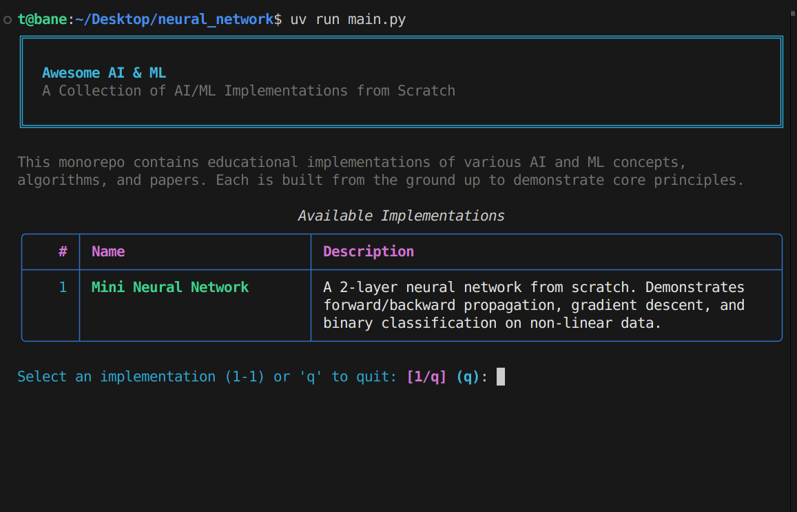

# Awesome AI and ML

<div align="start">

A collection of AI and ML concept and paper implementations built from scratch for learning and experimentation.



_Interactive CLI for exploring AI/ML implementations_

**Created by [@sigmoid_stories](https://x.com/sigmoid_stories)**

</div>

## Table of Contents

- [Overview](#overview)
- [Getting Started](#getting-started)
- [Implementations](#implementations)
  - [Mini Neural Network](#mini-neural-network)
  - [Mini Bigram LM](#mini-bigram-lm)
  - [Decision Tree](#decision-tree)
- [Usage](#usage)
- [Project Structure](#project-structure)
- [Contributing](#contributing)

## Overview

This monorepo contains implementations of various AI and ML concepts, algorithms, and papers. Each implementation is designed to be educational, demonstrating core concepts from the ground up using minimal dependencies.

## Getting Started

This project uses [uv](https://github.com/astral-sh/uv) for fast, reliable Python package management.

### Installation

```bash
# Clone the repository
git clone https://github.com/ThembinkosiThemba/awesome-ai-ml-code.git
cd awesome-ai-ml-code

# Create virtual environment and install dependencies
uv venv && source .venv/bin/activate
uv sync
```

### Quick Start

Run the interactive CLI to explore and test different implementations:

```bash
uv run main.py
```

## Implementations

### Mini Neural Network

**Location:** `mini-neural-network/`

A simple 2-layer neural network built from scratch using NumPy.

### Mini Bigram LM

**Location:** `mini-lm/`

A simple Bigram Language Model implemented from scratch using NumPy.

### Decision Tree

**Location:** `decision_tree/`

A simple **Decision Tree Classifier** from scratch using Python and NumPy.

## Usage

### Interactive CLI

The main entry point provides an interactive menu to run different implementations:

```bash
uv run main.py
```

This will display a menu with all available implementations. Select one to run it directly.

### Running Individual Implementations

Each implementation can also be run independently:

```bash
# Mini Neural Network
cd mini-neural-network
uv run test_nn.py
```

## Contributing

This is a learning project! Feel free to:

- Add new implementations of AI/ML concepts
- Improve existing implementations
- Add more detailed explanations
- Create visualizations

Each new implementation should:

1. Have its own directory
2. Include a detailed README explaining the concept
3. Use minimal dependencies (prefer NumPy over frameworks when possible)
4. Include test/example scripts
